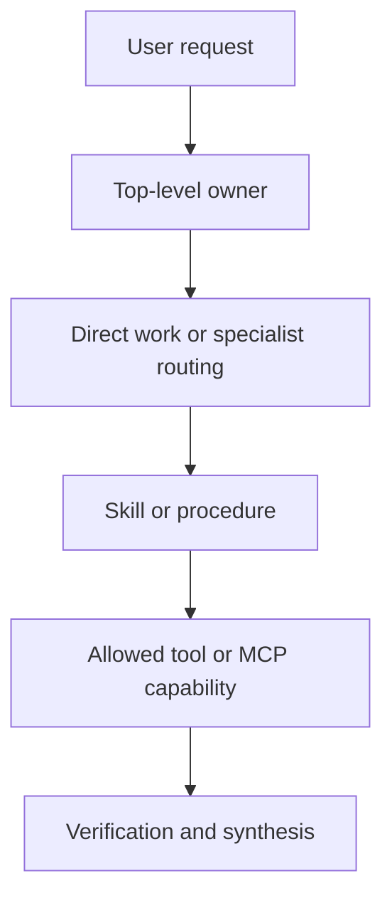
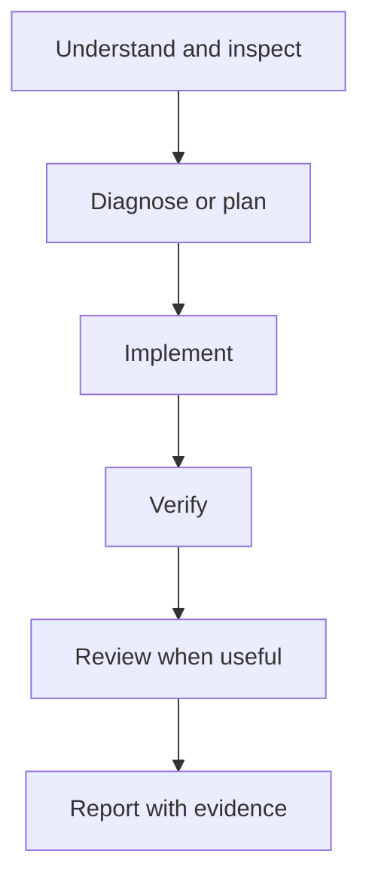

# Copilot User Layer Specification

> **Status:** Operational v1.1 — Architecture Frozen, Capability Baseline Updated  
> **Architecture baseline:** v1.0  
> **Operational revision:** v1.1  
> **Last updated:** 2026-09-05  
> **Primary environment:** VS Code Copilot Agent  

## 0. Executive Contract

This document is the single source of truth for the user's personal Copilot Agent environment.

The system supports two top-level work modes:

1. **Engineering**, owned by the native Copilot Agent;
2. **Scientific research**, owned by the custom Research Coordinator.

The architecture is intentionally small. Native capabilities remain the default; custom agents, Skills, and MCP servers are added only when they fill a concrete recurring gap.

The v1 role architecture is frozen. The capability layer is not permanently frozen: tools and MCP integrations may evolve when real work demonstrates a need, without redesigning agent ownership.

The governing maintenance rule is:

```text
real task
  → observed failure or recurring capability gap
  → identify the responsible layer
  → make the smallest justified change
  → validate the affected route
```

---

# 1. Scope and Boundaries

## 1.1 What “User Layer” Means

The User Layer is the user's cross-project Copilot control plane. It includes reusable behavior, role definitions, workflows, and approved runtime integrations.

It spans more than one physical location:

| Surface | Purpose | In scope |
|---|---|---:|
| `~/.copilot/instructions/` | Cross-project behavioral policy | Yes |
| `~/.copilot/agents/` | Custom roles and delegation topology | Yes |
| `~/.copilot/skills/` | Reusable procedures | Yes |
| `~/.copilot/hooks/` | Optional enforcement | Deferred |
| VS Code User `mcp.json` | Runtime MCP server configuration and secret inputs | Yes, as an integration boundary |
| VS Code extension tool providers | Pylance, Jupyter, Container Tools, and similar native/extension capabilities | Yes, as runtime dependencies |
| Repository `.github/` | Repository facts, commands, architecture, and local policy | No |
| Runtime state, logs, chats, caches, local credentials | Product/runtime data | No |

On the current Windows installation, the MCP configuration is stored in the VS Code user profile rather than under `~/.copilot`.

## 1.2 User Layer vs Repository Layer

The User Layer answers:

> How should my agents work across projects?

The Repository Layer answers:

> How does this specific repository work?

User-level policy may define:

- evidence-first debugging;
- verification before completion;
- research delegation;
- tool-selection principles;
- cross-project safety rules.

It must not assume a specific language, package manager, repository layout, test command, framework, model architecture, or research project. Those facts must be learned from the active repository.

## 1.3 Architecture vs Capability Baseline

These are deliberately separate:

| Baseline | Contains | Change threshold |
|---|---|---|
| Architecture | top-level owners, worker roles, Skill responsibilities, delegation rules | demonstrated role or ownership failure |
| Capability | MCP servers, extension tools, tool exposure, routing guidance | recurring information or execution need |
| Enforcement | Hooks and hard policy gates | clear safety benefit that justifies operational complexity |

Adding an MCP server does not automatically justify a new agent. Changing an agent does not automatically require a new tool.

---

# 2. System Model

## 2.1 Five Control Layers

The environment is organized as five cooperating layers:

| Layer | Question answered | Primary mechanism |
|---|---|---|
| Behavioral policy | How should work be performed? | Instructions |
| Ownership and routing | Who should own or investigate the task? | Native modes and custom agents |
| Reusable method | What procedure should be followed? | Skills |
| Capability | What information or action is available? | Native tools, extension tools, MCP servers |
| Enforcement | What must be blocked or intercepted? | Hooks, if later justified |

The normal control flow is:



Tool availability is not routing policy. A role may be technically able to call a server while its instructions still prohibit an inappropriate operation.

## 2.2 Top-Level Ownership

| Work type | Owner | Rule |
|---|---|---|
| Software implementation and repository work | Native Agent | Direct-first; delegates selectively |
| Broad scientific synthesis | Research Coordinator | Aggressive but bounded worker delegation |
| Repository exploration | Native Explore | Concrete code facts, symbols, call sites, state flow |
| Implementation/diff review | Native Code Review | Reviews code changes, not general reasoning |
| Independent reasoning challenge | Critic | Reviews plans, diagnoses, designs, and validation gaps |

Top-level coordinators are not nested by default. Engineering owns implementation; Research owns scientific synthesis. Both may directly consult shared specialist workers.

---

# 3. Design Principles

## P1. Native First

Use native Copilot capabilities when they already solve the problem:

| Native capability | Primary use |
|---|---|
| Ask | discussion and understanding |
| Plan | planning |
| Agent | implementation and execution |
| Explore | repository exploration |
| Code Review | implementation/diff review |
| Subagent delegation | context isolation and specialized investigation |

Do not create custom Planner, Implementer, Explorer, or Reviewer agents without a demonstrated gap.

## P2. Specialize by Cognitive Responsibility

Custom roles differ by objective, not by academic title:

- Literature Scout maximizes discovery coverage and bibliographic accuracy.
- Evidence Auditor maximizes skepticism toward claim–evidence alignment.
- Experiment Designer maximizes discriminating experimental design.
- Reproducibility Engineer maximizes implementation feasibility and reproducibility.
- Critic maximizes detection of important reasoning weaknesses.

## P3. Skills and Agents Have Different Jobs

Use a Skill for a reusable method. Use a subagent when independent context, a distinct objective, substantial investigation, or context compression materially helps.

## P4. Context Isolation Is a Primary Benefit

Workers should absorb large exploratory traces and return compact, structured findings. The parent should receive evidence, conclusions, conflicts, and uncertainty—not an unfiltered activity log.

## P5. Research Uses Orchestrator–Worker Design

Research is coordinated through a lead that decomposes, delegates, synthesizes, detects conflicts, and decides whether a second investigation wave is justified.

## P6. Delegation Is Aggressive but Bounded

Default research guardrails:

- first wave: up to roughly four independent worker tasks;
- second wave: only for an evidence gap, conflict, implementation ambiguity, or critical unverified assumption;
- duplicate-role calls: only for independent search tracks, replication, or competing hypotheses;
- Critic: normally after a substantive proposal or synthesis exists.

## P7. Reflection Is Selective

Critic is high value when a concrete plan, diagnosis, design, or synthesis exists. It is not a ritual step for every simple task and not a first-wave discovery worker.

## P8. No Maintained Multi-Agent Debate

Position-based debate is excluded from v1. Specialized workers, evidence-based synthesis, and Critic already provide useful independent perspectives without encouraging artificial disagreement.

## P9. Keep the System Explainable

Every added component must answer:

1. What recurring gap exists?
2. Why is a native capability insufficient?
3. Why is this the correct layer to change?
4. What unique responsibility is added?
5. What is the smallest validation that proves value?

## P10. Tool Access Is Deliberate

Prefer local repository evidence before external documentation. Prefer domain-specific authoritative sources over generic browsing. Do not invoke a tool merely because it is available.

## P11. Capability and Permission Are Separate

Exposing an entire MCP server reduces per-tool maintenance, but it does not grant semantic permission to perform every operation. Role instructions constrain when and how server capabilities may be used.

## P12. Failures Are Evidence, Not Answers

A failed query, rate limit, missing identifier, or unavailable API is not evidence that a paper, feature, or fact does not exist. Report the failure, try a suitable alternate route when justified, and preserve uncertainty.

---

# 4. Maintained Component Inventory

## 4.1 Instructions

| File | Role | Status |
|---|---|---:|
| `instructions/engineering.instructions.md` | Cross-project engineering behavior and tool routing | Active; frontmatter validated |
| `instructions/math-formatting.instructions.md` | Cross-project mathematical formatting | Active |

## 4.2 Agents

```text
agents/
├── core/
│   └── critic.agent.md
└── research/
    ├── research.agent.md
    ├── literature-scout.agent.md
    ├── evidence-auditor.agent.md
    ├── experiment-designer.agent.md
    └── reproducibility-engineer.agent.md
```

Grouped roots are registered explicitly through `chat.agentFilesLocations`; implicit recursive discovery is not assumed.

## 4.3 Skills

| Skill | Architectural role | Status |
|---|---|---:|
| `systematic-debugging` | Root-cause investigation for unexplained failures | Core; audited PASS WITH PATCH |
| `verification-before-completion` | Completion evidence gate | Core; accepted |
| `paper-reading` | Deep analysis of a concrete paper | Core; integration verified |
| `grill-me` | Intensive questioning and decision pressure-testing | Retained; manual-only |
| `paper-reviewer` | Structured paper review | Installed auxiliary capability |
| `scifig-scientific-figure` | Scientific-figure workflow | Installed auxiliary capability |
| `find-skills` | Skill discovery support | Installed auxiliary capability |

Auxiliary Skills are available but are not mandatory dependencies of the Engineering or Research topology.

## 4.4 Hooks

Hooks remain optional and non-blocking. The current architecture does not depend on Hook execution for correctness.

---

# 5. Engineering Layer

**Status:** Architecture frozen at v1.

The native Agent owns engineering tasks and implementation. There is no separate Engineering Coordinator.

## 5.1 Engineering Lifecycle



This is not a mandatory full pipeline. Simple work may compress to inspect → edit → targeted verification.

## 5.2 Engineering Routing

| Situation | Route |
|---|---|
| Simple implementation | Native Agent |
| Repository structure, symbols, call sites, or state flow | Explore |
| Unexplained bug, test, build, runtime, or regression failure | `systematic-debugging` |
| Substantive plan, diagnosis, or design needs independent challenge | Critic |
| Concrete paper understanding affects implementation | `paper-reading` |
| Scientific method must become implementation requirements | Reproducibility Engineer |
| Scientific claim materially affects an engineering decision | Evidence Auditor |
| Need a discriminating scientific validation plan | Experiment Designer |
| Scientific literature is genuinely necessary | Literature Scout |
| Completion is about to be claimed | `verification-before-completion` |
| Existing implementation or diff needs review | Native Code Review |
| Broad scientific synthesis is the primary task | User explicitly selects Research |

Do not route ordinary engineering work through the Research Coordinator.

## 5.3 Engineering Tool Routing

1. Inspect the active repository, dependency files, configuration, and existing implementation first.
2. Use Context7 when current or version-specific library, framework, SDK, or API documentation is required.
3. Prefer documentation matching the dependency version actually used by the repository.
4. Use Hugging Face when work depends on Hub models, datasets, Spaces, repository metadata, or model-specific integration details.
5. For Python projects, use Pylance when workspace-aware import analysis, symbol inspection, type diagnostics, refactoring, debugging, or profiling is relevant.
6. Use Jupyter tools only for actual notebook or kernel tasks.
7. Use Container Tools only when the repository already uses containers, Dev Containers, Dockerfiles, or containerized execution.
8. Do not use Semantic Scholar, arXiv, or Zotero for ordinary engineering tasks unless scientific evidence is materially required.
9. Tool availability never implies mandatory use.

---

# 6. Scientific Research Layer

**Status:** Architecture frozen at v1; capability routing under operational refinement.

## 6.1 Research Topology

The Research Coordinator owns decomposition and final synthesis. Workers keep distinct epistemic responsibilities.

| Role | Primary question | Optimization target |
|---|---|---|
| Research Coordinator | How should the full question be decomposed and synthesized? | coherent evidence-based conclusion |
| Literature Scout | What relevant prior work exists? | coverage, recall, bibliographic accuracy |
| Evidence Auditor | Do the claims follow from the evidence? | skepticism, fairness, confounder detection |
| Experiment Designer | What test would distinguish competing explanations? | discriminating controls, baselines, metrics |
| Reproducibility Engineer | Can the method actually be implemented and reproduced? | concrete requirements, hidden choices, feasibility |
| Critic | What important weakness remains? | independent challenge |
| `paper-reading` | What does this concrete paper actually do? | deep method and evidence understanding |

Native Explore remains available for repository facts.

## 6.2 Research Coordinator

Recommended frontmatter behavior:

```yaml
user-invocable: true
disable-model-invocation: true
```

Maintained coordinator tool set:

```text
vscode + read + search + web + agent + todo
```

The coordinator should remain an orchestrator, not a mega-agent. It delegates deep discovery or specialized analysis and performs only small targeted checks itself.

## 6.3 Literature Scout

Responsibilities:

- discover directly relevant, mechanistically relevant, and contextual work;
- search iteratively across terminology and method families;
- verify title, authors, year, venue/status, and stable identifiers where practical;
- distinguish bibliographic facts, paper claims, interpretation, relevance judgment, and uncertainty;
- return a compact literature map rather than raw result dumps.

Current capability set:

```text
web + search + read
semanticscholar/* + arxiv/* + zotero/*
```

Semantic policy:

- Zotero is read-only for Literature Scout. Do not create, update, delete, attach, annotate, tag, or reorganize items.
- For a known paper title, prefer Semantic Scholar title matching rather than author search.
- For a topic, use paper-search endpoints; use author search only when the input is actually an author.
- Use arXiv metadata and abstracts first; request full text or source only when the task requires it.
- Distinguish preprint year, publication year, and local Zotero metadata instead of silently choosing one.
- Cross-check important bibliographic facts across sources when they disagree.
- Avoid unnecessary parallel API bursts, especially while Semantic Scholar is keyless.

The tool access is already active. The corresponding behavioral routing section in the live Literature Scout file is the next implementation task and is therefore marked **pending hardening**, not complete.

## 6.4 Evidence Auditor

Focus:

- claim–evidence alignment;
- baseline fairness;
- ablations and controls;
- evaluation protocols;
- leakage, confounders, and statistical support;
- overclaiming and unsupported generalization.

Current capability set:

```text
read + search + web
semanticscholar/* + arxiv/* + zotero/*
```

Academic and Zotero sources are for evidence retrieval and verification. The worker should not modify the Zotero library.

## 6.5 Experiment Designer

Focus:

- hypotheses and competing explanations;
- baselines, controls, and ablations;
- metrics and stopping criteria;
- stress tests and failure analysis;
- experiments that can falsify a mechanism claim.

Current capability set:

```text
read + search + web
context7/* + huggingface/*
```

Context7 and Hugging Face are used only when technical documentation or model/dataset facts materially affect the design.

## 6.6 Reproducibility Engineer

Focus:

- repositories and dependencies;
- data and model requirements;
- compute, memory, and environment constraints;
- configuration and hidden implementation choices;
- concrete reproduction plans and risks.

Current capability set:

```text
read + search + web + execute
context7/* + huggingface/*
```

Execution is used for bounded inspection and validation relevant to reproducibility, not for taking ownership of general implementation.

## 6.7 Critic

Critic is a shared, read-only reasoning worker. It challenges plans, designs, diagnoses, experiments, and syntheses. It does not replace Native Code Review and should not be used merely to inflate worker count.

## 6.8 Canonical Research Routes

| Task shape | Preferred route |
|---|---|
| Broad literature question | Literature Scout → coordinator synthesis; Evidence Auditor or Critic only if needed |
| One concrete paper | `paper-reading`; add Evidence Auditor for claim audit or Reproducibility Engineer for implementation |
| New method design | Literature Scout → Experiment Designer → Reproducibility Engineer → Critic when substantive |
| Existing method evaluation | Evidence Auditor + Experiment Designer; Reproducibility Engineer if implementation feasibility matters |
| Method-to-code translation | Reproducibility Engineer directly; Native Agent retains implementation ownership |
| Strong competing hypotheses | Evidence Auditor + Experiment Designer → coordinator synthesis → Critic |
| Simple bibliographic lookup | Direct minimal call; no full worker roster |

---

# 7. Skill Layer

## 7.1 `systematic-debugging`

Use for unexplained failures, regressions, inconsistent behavior, failing tests, build/runtime errors, and uncertain root causes.

Core behavior:

```text
reproduce → gather evidence → form hypotheses → discriminate → fix root cause → verify
```

The User-Layer version is tool-neutral, platform-neutral, scoped, and cautious around destructive diagnostics.

## 7.2 `verification-before-completion`

Use before claiming engineering work is complete.

Evidence should be:

- fresh;
- relevant to the changed behavior;
- discriminating rather than ceremonial;
- inspectable;
- honestly scoped.

Current worker evidence may be reused when it remains fresh and directly supports the claim. Unverified scope must be reported explicitly.

## 7.3 `paper-reading`

Use for deep analysis of one concrete paper or a small explicitly named set. It replaces the previously considered Scientific Analyst agent and must be invoked through the registered Skill mechanism, not guessed filesystem paths.

## 7.4 `grill-me`

Retain as a manual-only intensive questioning workflow. It should not auto-trigger during ordinary work.

## 7.5 Auxiliary Skills

`paper-reviewer`, `scifig-scientific-figure`, and `find-skills` extend the environment without changing the core architecture. Their presence does not require coordinators to invoke them automatically.

---

# 8. Tool and MCP Capability Layer

## 8.1 Purpose

MCP servers provide capabilities; agents and instructions decide whether those capabilities are appropriate for a task.

The capability stack has four gates:

| Gate | Function |
|---|---|
| Server configuration | Can VS Code start and connect to the provider? |
| Global tool selection | Is the provider available to Copilot sessions? |
| Agent frontmatter | Can this custom role see the server tool set? |
| Behavioral routing | When and how may the role use it? |

A server being “Running” proves connectivity and tool discovery, not correct task routing.

## 8.2 Current Maintained Baseline

| Provider | Type | Primary role | Current status |
|---|---|---|---:|
| Context7 | Remote MCP | Current library/framework/SDK documentation | Running; real documentation query passed |
| Semantic Scholar | Local stdio MCP backed by remote API | Scholarly search, matching, metadata, citation graph | Running keyless; title match passed; rate limit observed; API key pending and non-blocking |
| arXiv | Local stdio MCP | arXiv search, metadata, abstracts, and bounded paper/source retrieval | Running; basic test passed |
| Zotero | Local stdio MCP + local Zotero API | Personal library search, metadata, notes, attachments, and controlled library actions | Running; local API and read-only calls passed |
| Hugging Face | Remote HTTP MCP | Hub models, datasets, Spaces, and repository metadata | Authenticated; tools discovered and available |
| Pylance | VS Code extension tool provider | Python workspace analysis, refactoring, debugging, profiling | Available and usable |
| Jupyter | VS Code extension tool provider | Notebook/kernel inspection and execution | Available and usable |
| Container Tools | VS Code extension tool provider | Container-aware repository work | Available; route only when repository context requires it |

No additional MCP server is justified at this stage. The next work is routing hardening, not inventory expansion.

## 8.3 Whole-Server Exposure

Whole-server references are intentionally used to avoid brittle per-tool lists:

```yaml
'context7/*'
'semanticscholar/*'
'arxiv/*'
'zotero/*'
'huggingface/*'
```

VS Code validates these references against canonical lowercase server identifiers. The display/configuration key in `mcp.json` may retain camelCase, while custom-agent wildcard references use the canonical lowercase form.

Whole-server exposure is accepted only with role-level semantic constraints. In particular, Literature Scout and Evidence Auditor remain read-only toward Zotero even though the server exposes write tools.

## 8.4 Provider Routing Rules

### Context7

- inspect local dependency/version evidence first;
- use when current or version-specific official documentation matters;
- query the actual library and version used by the repository where possible;
- do not use it for facts already clear from local code.

### Semantic Scholar

- known title → title/paper matching;
- topic query → paper search or bulk search;
- author identity query → author search;
- citation relationships → citation/reference tools only when relevant;
- avoid bursty duplicate calls while keyless;
- treat rate limits as provider failures, not negative research results.

### arXiv

- begin with search and metadata/abstract retrieval;
- fetch paper text or source only when deeper analysis requires it;
- keep preprint status distinct from peer-reviewed publication status;
- use bounded retrieval to protect context.

### Zotero

- use the personal library before re-discovering already collected papers;
- read metadata, notes, attachments, and full text only as needed;
- research discovery/audit workers are read-only;
- write operations require explicit user intent or a workflow whose role clearly owns that action;
- Zotero desktop and its local API must be running for local calls.

### Hugging Face

- use for Hub-specific model, dataset, Space, collection, or repository facts;
- do not use it as a generic web search engine;
- never place the bearer token directly in agent files or documentation;
- obtain authentication through the configured VS Code input.

### Pylance, Jupyter, and Container Tools

- Pylance: Python workspace semantics and diagnostics;
- Jupyter: genuine notebook/kernel work only;
- Container Tools: existing containerized workflows only.

## 8.5 Version and Secret Policy

- Rolling latest versions are acceptable for these MCP launchers by default.
- Pin a version only after an actual compatibility or reproducibility problem.
- Secrets belong in secure runtime inputs or environment-backed configuration.
- Never hard-code, print, or copy tokens into agent, Skill, instruction, or specification files.
- The pending Semantic Scholar API key is an optional rate-limit improvement, not a blocker for the current plan.

## 8.6 Failure and Fallback Policy

When an MCP call fails:

1. classify the failure: invalid routing, provider rate limit, authentication, local service unavailable, malformed query, or missing data;
2. correct a clear routing error once;
3. use an alternate authoritative provider when it materially improves confidence;
4. do not convert failure into a factual conclusion;
5. report unresolved uncertainty to the parent agent or user.

---

# 9. Security and Operational Safety

## 9.1 Least Semantic Privilege

Use the minimum capability appropriate to the role, even when a broader server tool set is exposed technically.

Examples:

- Literature Scout may read Zotero but not mutate it.
- Research Coordinator delegates rather than collecting every server itself.
- Reproducibility Engineer may execute bounded diagnostics but does not own general implementation.
- Jupyter is not introduced into ordinary projects merely because it is available.

## 9.2 Destructive and External Actions

Do not perform destructive, irreversible, or externally visible actions without clear task authority. Do not enable broad auto-approval for sensitive MCP operations.

## 9.3 Runtime and Secret Isolation

Runtime logs, chat state, caches, local configuration state, credentials, and tokens are not behavioral specification assets. They must remain outside agent prompts and reusable documentation.

## 9.4 Browser Automation

Browser automation is not part of the maintained baseline. Zotero and dedicated scholarly providers cover the current research workflow more directly. Native web access may remain available for targeted external verification when dedicated sources are insufficient.

---

# 10. Verified Evidence and Known Gaps

## 10.1 Verified

- custom endpoint chat, Agent mode, tool calling, and subagent execution work;
- Explore and custom workers execute through the current endpoint;
- Critic works as a shared custom subagent;
- Native Code Review is enabled;
- Research Coordinator can route to multiple specialized workers;
- registered `paper-reading` routing works;
- Context7 completed a real current-documentation query;
- Semantic Scholar server started, exposed tools, and matched a paper by title;
- arXiv basic invocation passed;
- Zotero local API, server, recent-item lookup, and item metadata lookup passed;
- Hugging Face authenticated and exposed its tool set;
- Pylance and Jupyter tools are usable;
- the engineering instruction frontmatter is valid and the minimal engineering routing test passed;
- lowercase whole-server references are accepted by VS Code custom-agent validation.

## 10.2 Known Gaps

| Gap | Impact | Blocking? |
|---|---|---:|
| Literature Scout body lacks explicit MCP routing/read-only rules | Can choose the wrong scholarly endpoint or an unsafe Zotero action | Next priority |
| Semantic Scholar API key not yet issued | Lower rate limits | No |
| Experiment Designer and Reproducibility Engineer have only concise provider guidance | May underuse or overuse Context7/Hugging Face | No; harden after Scout |
| Evidence Auditor needs an explicit read-only scholarly-source statement in its live body | Frontmatter exposes more capability than its role needs semantically | No; same hardening pass |
| Hooks are not operational dependencies | No hard interception layer | No |

## 10.3 What Is Not Yet Claimed

This specification does not claim:

- exhaustive MCP benchmarking;
- stable unlimited Semantic Scholar access without a key;
- validation of every tool exposed by each server;
- complete cross-platform equivalence for local Zotero access;
- working safety Hooks;
- repository-specific workflow coverage.

---

# 11. Freeze and Change Policy

## 11.1 Frozen Architecture

The following remain frozen unless real tasks demonstrate a repeatable failure:

- Native Agent as engineering owner;
- Research Coordinator as scientific-synthesis owner;
- Literature Scout, Evidence Auditor, Experiment Designer, and Reproducibility Engineer as distinct workers;
- Critic as a shared independent reviewer;
- `paper-reading` as the concrete-paper deep-analysis workflow;
- no top-level coordinator nesting by default;
- no maintained Multi-Agent Debate.

## 11.2 Evolvable Capability Layer

The following may change with smaller evidence thresholds:

- MCP server versions;
- authentication inputs;
- role-specific tool exposure;
- provider routing text;
- targeted fallback rules;
- extension tool usage guidance.

Capability changes should preserve the frozen ownership model.

## 11.3 Change Classification

| Change | Classification | Required validation |
|---|---|---|
| Clarify provider routing | Operational patch | one representative tool-route test |
| Add/remove a role's server wildcard | Capability change | validator check + role-specific smoke test |
| Add a new MCP server | Capability expansion | recurring use case + minimal integration test |
| Add a new worker | Architecture change | demonstrated responsibility gap + overlap review |
| Add a Hook | Enforcement change | invocation proof + false-positive and recovery analysis |

---

# 12. Immediate Next Plan

The next phase is **MCP routing hardening**, not adding more servers.

## N1. Literature Scout Routing Patch — Next

Add the semantic rules already specified in §6.3 and §8.4 to `literature-scout.agent.md`:

1. Zotero read-only boundary;
2. Semantic Scholar title/topic/author endpoint selection;
3. arXiv metadata-first and bounded full-text use;
4. cross-source conflict handling;
5. rate-limit and failed-call semantics.

Validation: one minimal read-only task that starts from a recent Zotero item and verifies it through one appropriate scholarly provider, with no writes.

## N2. Remaining Research Worker Hardening

Apply concise role-specific rules:

- Evidence Auditor: scholarly sources and Zotero are read-only; failed retrieval is not negative evidence.
- Experiment Designer: use Context7/Hugging Face only when documentation or model/dataset facts affect experimental validity.
- Reproducibility Engineer: local repository evidence first; then Context7/Hugging Face for unresolved external facts.

Validation: inspect frontmatter and run only one targeted scenario per changed route if needed.

## N3. Engineering Capability Check

Run one small engineering task that requires local inspection plus exactly one justified external provider. Confirm that ordinary engineering does not invoke academic MCP servers.

## N4. Operational Baseline Review

After N1–N3:

- record observed failures and corrections;
- remove redundant wording;
- mark the MCP routing baseline operational;
- stop expanding the server inventory until another real recurring gap appears.

## N5. Optional Later Work

- add the Semantic Scholar API key when issued;
- reconsider Hooks only after a concrete safety need;
- evaluate cross-platform local-service behavior only when needed;
- create repository-specific layers separately from this specification.

---

# 13. Deferred or Excluded Components

| Component | Decision |
|---|---|
| Separate Engineering Coordinator | Rejected; native Agent owns engineering |
| Custom Planner/Implementer/Explorer/Reviewer | Rejected until native capability fails materially |
| Scientific Analyst agent | Rejected; use `paper-reading` |
| Generic Researcher worker | Rejected; responsibility would be too broad |
| Maintained Multi-Agent Debate | Rejected for v1 |
| Agent swarm or deep recursive orchestration | Rejected |
| Browser automation MCP | Excluded from current baseline |
| Generic filesystem/memory/database MCP expansion | Excluded without a recurring need |
| Safety Hooks as a blocking dependency | Deferred |
| Semantic Scholar API key | Pending, optional |

---

# 14. Acceptance Criteria

The User Layer v1.1 operational specification is accepted when:

1. engineering and research have distinct top-level owners;
2. ordinary engineering remains direct-first;
3. research workers retain distinct cognitive responsibilities;
4. top-level coordinators are not nested by default;
5. Skills represent reusable procedures rather than duplicate roles;
6. MCP servers are treated as capabilities rather than new owners;
7. agent frontmatter uses valid canonical server references;
8. whole-server exposure is paired with semantic role constraints;
9. Zotero discovery/audit routes remain read-only unless explicit authority says otherwise;
10. external documentation follows local repository inspection in engineering;
11. provider failures are reported as failures rather than negative evidence;
12. secrets are supplied through secure runtime inputs and never embedded in prompts;
13. completion claims cite validation actually performed;
14. architecture changes require a demonstrated role-level gap;
15. capability changes require a real use case and targeted validation;
16. the system remains small enough to explain and maintain.

---

# 15. Decision Log

## Architecture Decisions

| ID | Decision | Status |
|---|---|---:|
| D001 | Prefer native Copilot capabilities before custom equivalents | Accepted |
| D002 | Separate cross-project User Layer policy from repository facts | Accepted |
| D003 | Specialize workers by cognitive responsibility | Accepted |
| D004 | Use an orchestrator–worker topology for research | Accepted |
| D005 | Reuse Critic across engineering and research | Accepted and verified |
| D006 | Prefer evidence-oriented workers plus Critic over position-based debate | Accepted |
| D007 | Treat current custom endpoint subagent execution as supported | Verified |
| D008 | Reuse `paper-reading`; do not add Scientific Analyst | Accepted and verified |
| D010 | Research delegation is aggressive but bounded | Accepted |
| D011 | Remove Multi-Agent Debate from maintained v1 | Accepted |
| D012 | Group agent directories and register roots explicitly | Accepted and verified |
| D013 | Keep Research Coordinator tools focused on coordination | Accepted |
| D014 | Use phase-aware research orchestration | Accepted and smoke-tested |
| D015 | Invoke `paper-reading` through the registered Skill mechanism | Accepted and verified |
| D016 | Freeze Research role architecture at v1 | Accepted |
| D017 | Share specialist workers across top-level modes without coordinator nesting | Accepted |
| D018 | Engineering is direct-first, evidence-driven, and selectively delegated | Accepted |
| D019 | Retain adapted `systematic-debugging` | PASS WITH PATCH |
| D020 | Use `verification-before-completion` as completion evidence gate | Accepted |
| D021 | Keep Hooks optional and non-blocking | Deferred |
| D023 | Freeze overall role architecture at v1 | Accepted |

## Capability Decisions

| ID | Decision | Status |
|---|---|---:|
| D009 | Literature Scout began with native read/search/web and may expand after evidence | Superseded by D024 |
| D022 | Avoid speculative MCP expansion | Retained as a principle; operational baseline updated by D024 |
| D024 | Add Context7, Semantic Scholar, arXiv, Zotero, and Hugging Face after concrete engineering/research needs emerged | Accepted and implemented |
| D025 | Use whole-server wildcard exposure with role-level semantic constraints | Accepted |
| D026 | Use canonical lowercase MCP server references in custom-agent frontmatter | Accepted and verified |
| D027 | Separate architecture freeze from evolvable capability baseline | Accepted |
| D028 | Treat VS Code User `mcp.json` and extension providers as runtime integration surfaces of the User Layer | Accepted |
| D029 | Keep scholarly discovery/audit access to Zotero read-only by role policy | Accepted; live prompt hardening pending |
| D030 | Default to rolling latest MCP launchers; pin only after a compatibility or reproducibility need | Accepted |

---

# 16. Change Log

## v1.1 — 2026-09-05

- Reframed the document around a frozen architecture and an evidence-driven capability baseline.
- Expanded scope to include the VS Code User MCP configuration and extension tool providers as runtime integration boundaries.
- Replaced the outdated “academic MCP deferred” state with the actual operational baseline: Context7, Semantic Scholar, arXiv, Zotero, and Hugging Face.
- Added Pylance, Jupyter, and Container Tools routing.
- Documented whole-server wildcard exposure, canonical lowercase references, and semantic role constraints.
- Recorded Zotero read-only policy for Literature Scout and Evidence Auditor.
- Recorded keyless Semantic Scholar operation, observed rate limiting, and the pending non-blocking API key.
- Added provider-specific routing and failure semantics.
- Added the installed auxiliary Skills without making them core architectural dependencies.
- Removed obsolete contradictions from roadmap, open questions, acceptance criteria, and decision history.
- Replaced the completed construction roadmap with an immediate MCP routing-hardening plan.
- Added D024–D030 and marked superseded decisions explicitly.

## v1.0 — 2026-09-03

- Froze Engineering and Research role architecture.
- Established Native Agent and Research Coordinator ownership boundaries.
- Formalized direct-first engineering and bounded, role-aware, phase-aware research delegation.
- Accepted `systematic-debugging` and `verification-before-completion` as core Engineering Skills.
- Verified `paper-reading` and Critic integration.
- Allowed direct access to shared specialist workers without nesting top-level coordinators.
- Deferred Hooks and rejected maintained Multi-Agent Debate.

## v0.3 — 2026-09-02

- Completed and verified Research Layer v1.
- Added grouped agent roots and phase-aware research orchestration.
- Removed Debate from the maintained topology.

## v0.2 — 2026-09-02

- Replaced planned Scientific Analyst with `paper-reading`.
- Established initial Literature Scout tool policy and bounded delegation.
- Added grouped agent-directory design.

## v0.1 — 2026-09-02

- Established the initial User Layer architecture and research worker design.

